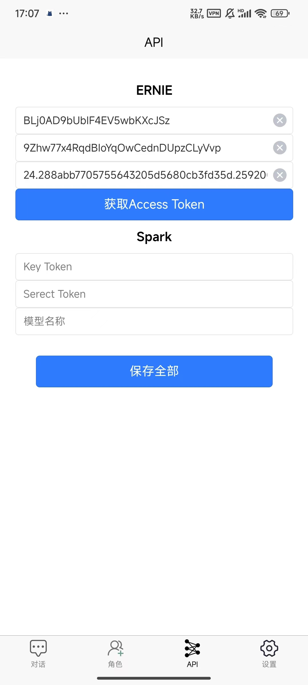
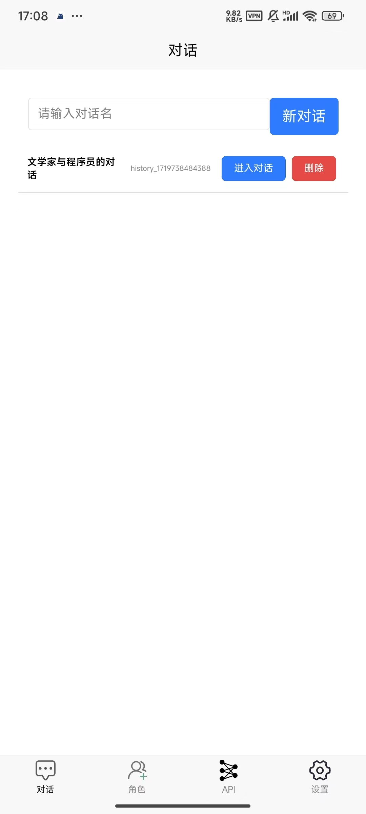

# Chat Free

一款高度定制化的AI聊天APP，通过免费大语言模型API进行交互。

**本应用是一个用于交作业的DEMO，仅供教育用途，禁止一切商用行为！**

## 快速上手

1. 创建角色，点击添加角色，输入名称和描述，点击添加

<!--  -->

2. 设置API Token，输入API Key、Secret Key，点击获取Access Token(如果有)，点击保存全部

<!--  -->

3. 创建对话，输入对话名，点击新对话

<!--  -->

4. 在对话中随时切换角色，进行畅快的聊天吧！

<!--  -->

## 特性

1. 高度定制化的角色，可以为每个角色设计描述
2. 自定义API，后续将开发更加定制化的设置
3. 对话历史，可以创建多个对话，保存每个对话的历史
4. 角色切换，每个对话中可以切换不同的角色
5. 记忆功能，对话时可选择是否记忆先前的历史，AI将作出不同的回答

## 感谢

本应用基于uniapp, 百度ERNIE，讯飞Spark等框架和模型实现，感谢以上作者和机构的贡献！
